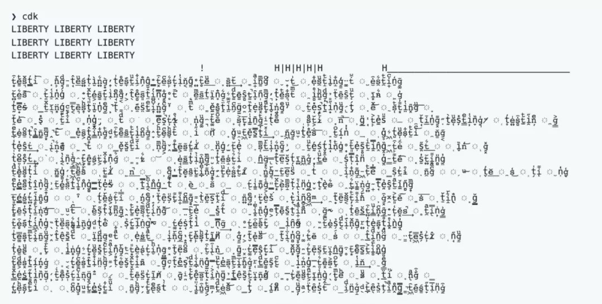
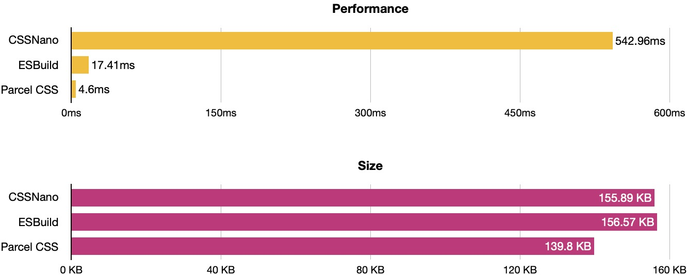
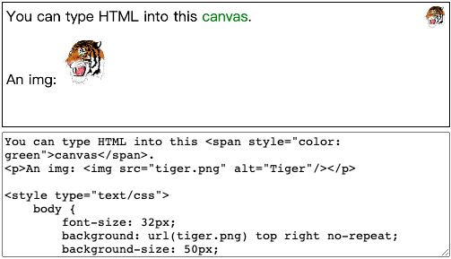

# 1 月

### 第二周:animations& transitions,架构

#### 技术

1. [为什么 IndexedDB 很慢以及使用什么代替](https://rxdb.info/slow-indexeddb.html)
2. ["我"做系统架构的一些原则](https://coolshell.cn/articles/21672.html)
3. [理解 CSS animations 和 transitions 的性能问题与动画调试](https://developer.aliyun.com/article/197594)
4. [图解 React 源码系列](https://github.com/7kms/react-illustration-series)
5. [2021 年 CSS 发展情况](https://2021.stateofcss.com/zh-Hans/)
6. [看完了 2021 CSS 年度报告，我学到了啥？](https://mp.weixin.qq.com/s/BbH6IleqLly82Mqx_0W1IQ)
7. [认知偏差知识手册](https://s75w5y7vut.feishu.cn/docs/doccn3BatnScBJe7wD7K3S5poFf)
8. [vscode console 插件](https://marketplace.visualstudio.com/items?itemName=AT-9420.console-helper)

#### 言论

1. toB 的行业很难垄断，因为客户不允许。
2. 人和人是不平等的，其中最重要的，是人与人有知识的差异

### 第三周:fakerjs,css in 2022,js rising starts,react-pdf

#### 技术

1. [naivue ui 组件](https://www.naiveui.com)<br />
2. [faker.js](https://github.com/marak/Faker.js/)<br />
   faker.js 的作者删库了
   可能会碰到的问题（我反正是中招了）[文章](https://www.jiqizhixin.com/articles/2022-01-10-2)
   

3. [JavaScript Rising Stars](https://risingstars.js.org/2021/en)<br />
   第 6 版 JavaScript Rising Stars
4. [CSS in 2022](https://www.bram.us/2021/12/27/css-in-2022/)
5. [性能优化，有时候是件体力活](https://mp.weixin.qq.com/s/_BKgmMtC6n3mAznCKDQUyA)
6. [React-pdf](https://github.com/diegomura/react-pdf)<br />
   This package is used to create PDFs using React. If you wish to display existing PDFs, you may be looking for [react-pdf](https://github.com/wojtekmaj/react-pdf)
7. [quick-lint-js](https://quick-lint-js.com/)<br />
   [ Over 110× faster than ESLint](https://quick-lint-js.com/benchmarks/), quick-lint-js gives you instant feedback as you code. Find bugs in your JavaScript before your finger leaves the keyboard. Lint any JavaScript file with no configuration.
   😔 但是还不支持 JSX 语法（在 React 代码中使用）
8. [roughViz:手写稿风格图标库](https://github.com/jwilber/roughViz)
9. [perspective:快速数据流可视化工具](https://perspective.finos.org/)
10. [vantajs:网站动画背景工具](https://www.vantajs.com/)
11. [slidev:Presentation slides for developers](https://github.com/slidevjs/slidev)

#### 其他

1. 上周任务太零散，导致有些小需求忘记做了，该死该死
2. 为了系统的安全性，我们一直被告知永远不要相信用户或者前端的输入，同时今天在想，为了系统的稳定性前端也应该永远不要相信后端的返回。
3.

### 第四周:eleventy,danfo,npm trends

#### 技术

1. [eleventyjs 发布 1.0 版本](https://www.11ty.dev/)<br />
   更简单的静态网站生成器
2. [heapify 快速优先队列](https://github.com/luciopaiva/heapify)<br />
   A very fast JavaScript priority queue, implemented using a binary heap, which in turn is implemented using two underlying parallel typed arrays. No dependencies whatsoever; just plain, vanilla JS.
3. [danfojs 数据分析工具](https://danfo.jsdata.org/)<br />
   Danfo.js is an open-source, JavaScript library providing high-performance, intuitive, and easy-to-use data structures for manipulating and processing structured data.
4. [twojs](https://github.com/jonobr1/two.js)<br />
   A two-dimensional drawing api meant for modern browsers. It is renderer agnostic enabling the same api to render in multiple contexts: webgl, canvas2d, and svg.
5. angularjs1.0 停止维护
6. [中国色](http://zhongguose.com/)
7. [npm trends](https://www.npmtrends.com/)
8. [The list of 2021 visualization lists](https://www.maartenlambrechts.com/2021/12/29/the-list-of-2021-visualization-lists.html)
9. [解读 React Conf 2021](https://zhuanlan.zhihu.com/p/458279850)
10. [Luckysheet](https://github.com/mengshukeji/Luckysheet)<br />
    🚀Luckysheet ，一款纯前端类似 excel 的在线表格，功能强大、配置简单、完全开源。
11. [Matrix Multiplication](https://github.com/staltz/matrixmultiplication.xyz)<br />
    An interactive matrix multiplication calculator for educational purposes
12. [Vue 3 将成为新的默认版本](https://zhuanlan.zhihu.com/p/460055155)

#### 言论

1. 每个人都有两次生命，第二次是在意识到生命只有一次的时候。
2. 一个充满限制和商品化的互联网，正在取代原来那个曾经互相连通和开放的互联网。

### 第五周:parcel,rasterizeHTML,mojs

#### 技术

1. [Monio:函数式编程库](https://github.com/getify/monio)<br />

```
Just("Welcome, Monads")
.concat(Just(" And Friends"))
.map(v => v.toUpperCase())
.fold(Maybe.from)
.map(v => v + "!")
.fold(
    () => IO.of("--empty--"),
    greetings => IO(() => console.log(greetings))
)
.run()
```

2. [remix vs nextjs](https://remix.run/blog/remix-vs-next)<br />
3. [parcel:css 编译](https://github.com/parcel-bundler/parcel-css)<br />
   采用 rust 编写：benchmarks 如下
   
4. [astro：静态站点构建](https://astro.build/)
5. [umbrella JS：jQuery 轻量级代替品](https://github.com/franciscop/umbrella)
6. [scala JS](https://www.scala-js.org/)
7. [tinyBase：结构化状态库](https://github.com/tinyplex/tinybase)
8. [mo Js： 逐帧动画库](https://mojs.github.io/)
9. [rockpack：react 服务端渲染库](https://github.com/AlexSergey/rockpack)
10. [rasterizeHTML JS：在 canvas 中渲染 HTML](https://github.com/cburgmer/rasterizeHTML.js)<br />
    
11. [zustand：状态管理库](https://github.com/pmndrs/zustand)<br />
    A small, fast and scalable bearbones state-management solution using simplified flux principles. Has a comfy api based on hooks, isn't boilerplatey or opinionated
12. [React-Contexify：右键菜单](https://fkhadra.github.io/react-contexify/)
13. [braft-edito：react 富文本编辑器](https://braft.margox.cn/demos/basic)
14. [The Free Photo Editor in your Browser](https://edit.photo/)
    

#### 言论

1. 极度夸张的语言是极度虚伪的社会的反映，而暴力的语言是社会暴行的前驱。

#### 记录

1. 今日下雪宜爬山
   
   
